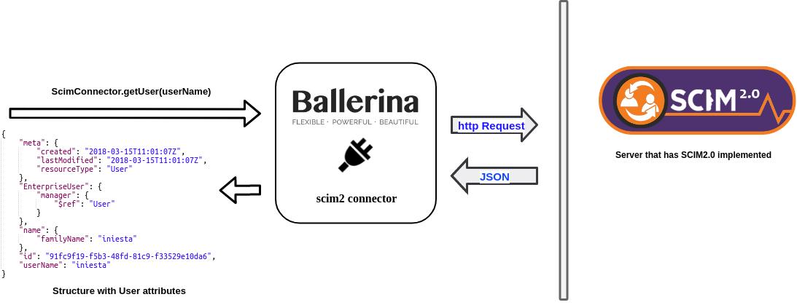

# Ballerina SCIM Connector

*The system for Cross-domain Identity Management (SCIM) specification
 is designed to make managing user identities in cloud-based applications 
 and services easier.*

 
 The Ballerina SCIM2 connector allows users to access Rest API of any service that implements 
 SCIM2 specification.  
 
 
 ## Compatibility
 | Language Version        | Connector Version          | API Versions  |
 | ------------- |:-------------:| -----:|
 | ballerina-0.970.0-alpha1-SNAPSHOT     | 0.9 | SCIM2.0 |
 


## Working with SCIM connector actions

In order for you to use the SCIM connector, first you need to create a ScimConnector 
endpoint.

```ballerina
endpoint scim2:Scim2Endpoint scimEP {
    oauthClientConfig:{
                          accessToken:"<...>",
                          baseUrl:"<...>",
                          clientId:"<...>",
                          clientSecret:"<...>",
                          refreshToken:"<...>",
                          refreshTokenEP:"<...>",
                          refreshTokenPath:"<...>",
                          setCredentialsInHeader:true,
                          clientConfig:{<...>}
                      }
};
```